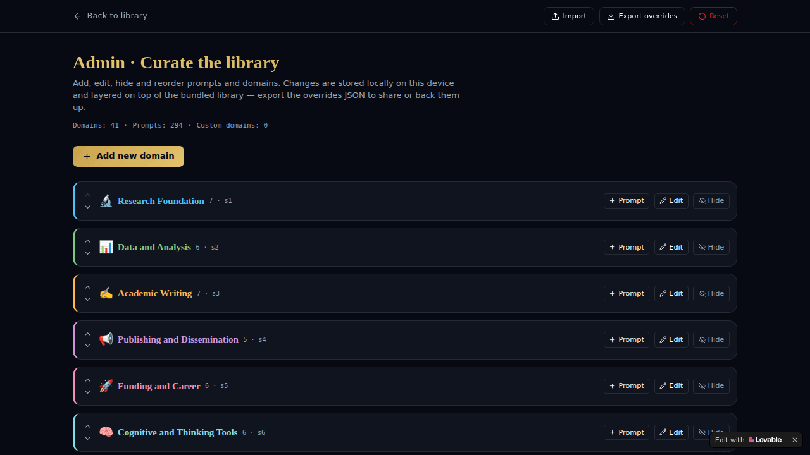
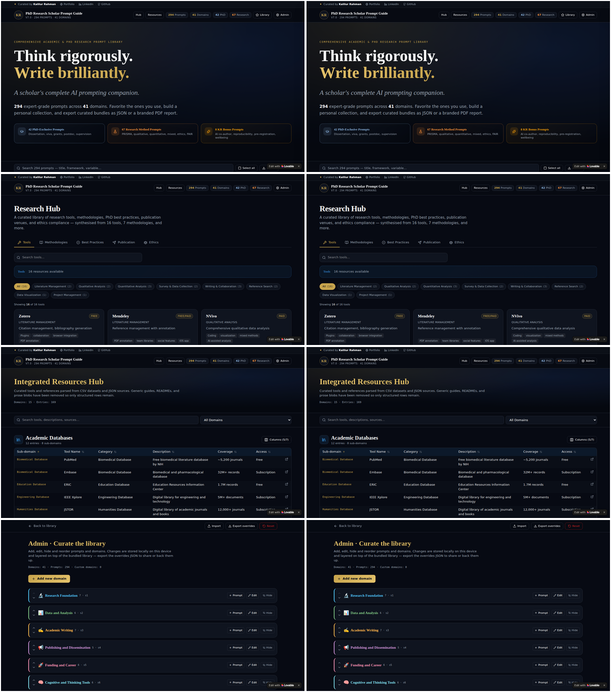

# PhD Research Assistant Prompt Guide

<div align="center">
  <h3>Think rigorously. Write brilliantly.</h3>
  <p><em>A scholar's complete AI prompting companion.</em></p>

  <p>
    
    
    
    
  </p>
</div>

---

## 🎬 Application Demo

Get a quick glance of the application's interface, light/dark modes, and various pages in action!



*(A high-quality MP4 version is also available in the repository as `app_demo.mp4`)*

---

## 🖼️ Theme & Page Showcase

Here is a comprehensive collage of the main pages (Home, Research Hub, Resources, and Admin) in both Light and Dark themes.



---

## 📖 Overview

The **PhD Research Assistant Prompt Guide** is a comprehensive, meticulously crafted platform designed specifically for PhD researchers and academic scholars. It houses an extensive library of **294 expert-grade AI prompts** distributed across **41 distinct domains**.

Whether you are navigating the complexities of your dissertation, preparing for a viva, applying for grants, or managing a postdoc project, this platform serves as an essential companion to elevate the rigorous thinking and brilliant writing required in academia.

### Key Highlights
- **Curated Prompt Library:** Over 290 prompts structured to assist in various research methodologies, academic writing, and administrative scholarly tasks.
- **PhD-Exclusive Support:** 42 dedicated prompts focusing specifically on dissertations, vivas, grant writing, and supervision.
- **Research Methodology:** 67 specialized prompts on PRISMA, qualitative/quantitative/mixed methods, research ethics, and FAIR data principles.
- **Bonus & Wellbeing Prompts:** Includes special prompts targeting AI co-authorship, study reproducibility, pre-registration, and scholar wellbeing.
- **Theme Support:** Fully responsive user interface with carefully tuned Light and Dark themes for comfortable reading during late-night writing sessions.

---

## 🚀 Features

### 1. The Research Hub
Your centralized dashboard for managing your academic prompt library. Quickly filter by category, framework, or methodology.

### 2. Resources Library
A structured repository of external tools, articles, and references that augment the provided prompts, ensuring scholars have comprehensive contextual knowledge at their fingertips.

### 3. Personal Library Management
Users can favorite the prompts they rely on most, building a personalized collection. Furthermore, curated bundles of prompts can be exported as standard JSON or cleanly branded PDF reports for offline reference or team sharing.

### 4. Admin Dashboard
A dedicated space to manage and curate the database of prompts, configure domains, and oversee platform analytics.

---

## 🛠️ Technology Stack

This application is built with a modern, fast, and robust frontend stack:

- **Framework:** React 19 / Vite
- **Routing:** TanStack Router ( `@tanstack/react-router` )
- **State Management:** TanStack Query (`@tanstack/react-query`)
- **Styling:** Tailwind CSS (v4) with Tailwind Merge & `tw-animate-css`
- **UI Components:** Radix UI primitives & Lucide React icons
- **Form Handling:** React Hook Form with Zod validation
- **PDF Generation:** `jspdf`

---

## 💻 Local Development & Setup

To get this project running on your local machine, follow the steps below:

### Prerequisites
- Node.js (v18 or higher recommended)
- `npm`, `yarn`, `pnpm`, or `bun`

### Installation

1. **Clone the repository:**
   ```bash
   git clone <repository-url>
   cd <repository-directory>
   ```

2. **Install dependencies:**
   ```bash
   npm install
   # or
   bun install
   ```

3. **Start the development server:**
   ```bash
   npm run dev
   # or
   bun run dev
   ```

4. **Build for production:**
   ```bash
   npm run build
   ```

5. **Preview the production build:**
   ```bash
   npm run preview
   ```

---

## 🤝 Contributing

We welcome contributions from fellow researchers and developers! If you have highly effective prompts or functional improvements, please feel free to fork the repository, make your changes, and submit a Pull Request.

1. Fork the Project
2. Create your Feature Branch (`git checkout -b feature/AmazingFeature`)
3. Commit your Changes (`git commit -m 'Add some AmazingFeature'`)
4. Push to the Branch (`git push origin feature/AmazingFeature`)
5. Open a Pull Request

---

## 📄 License

This project is open-source. Please see the LICENSE file for details.

---
*Curated by Kalilur Rahman*
